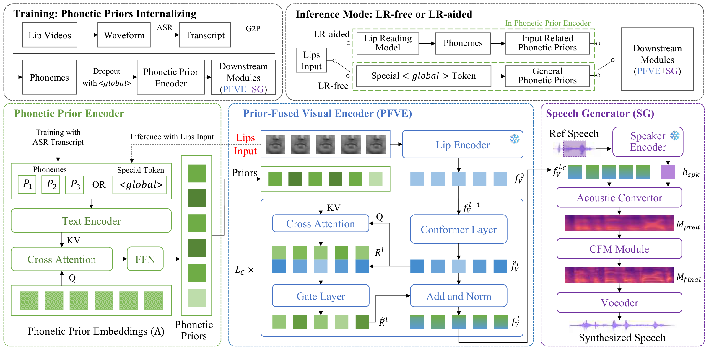

# FlexLTS

### A Unified Paradigm for Content-Accurate Lip-to-Speech Synthesis with Optional Lip Reading

[Zhechen Liu](https://github.com/JasonLiu20020101) · [Shuang Yang](https://vipl.ict.ac.cn/people/syang/) · [Shiguang Shan](https://vipl.ict.ac.cn/people/sgshan/) · [Xilin Chen](https://vipl.ict.ac.cn/people/xlchen/)

## Framework

